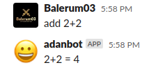
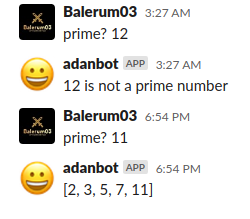
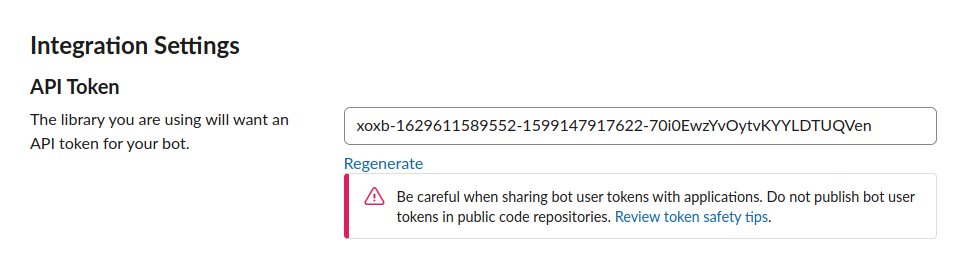
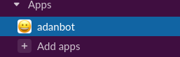

# Slack Bot


This project consist in the creation of a bot using the SlackRubyBot API, once connected you can interact with the bot using two commands, "add" and "prime?".
- add, will solve a simple sum for you and send it to you on the Slack chat as a message.


- prime?, will tell you all prime numbers below the number you enter.



## How to use this Slack Bot.
* After cloning this Repo, run
```
bundle install
```
* Create an Slack Bot user.
  You can do this by visiting this [page](https://slack.com/services/new/bot)

* Once your bot is created take your token and run (type your token where it says "your_token").

```
SLACK_API_TOKEN= your_token rails server
```


* You'll see under the Apps tab, that your bot is going to be there so that you can interact with it while the server is running.

  

 ## Built with
 - Ruby v2.7.0
 - Ruby on Rails 6.0.3.4
 - [Slack Ruby Client](https://github.com/slack-ruby/slack-ruby-client#create-a-new-bot-integration)
 - [React-rails](https://github.com/reactjs/react-rails)
 - PostgreSQL

## Video presentation
[YouTube video part. 1](https://youtu.be/17JrNUn6ksE)
[YouTube video part. 2](https://youtu.be/GobnJNrYnec)

## Author
Adan Fernandez Bonilla

- [Github: balerum03](https://github.com/balerum03)
- [LinkedIn: Adan Fernandez Bonilla](https://www.linkedin.com/in/adan-fernandez-bonilla/)
- [Twitter: balerum03](https://twitter.com/balerum03)

## 🤝 Contributing

Contributions, issues and feature requests are welcome!

Feel free to check the [issues page](issues/).

## Show your support

Give a ⭐️ if you like this project!
